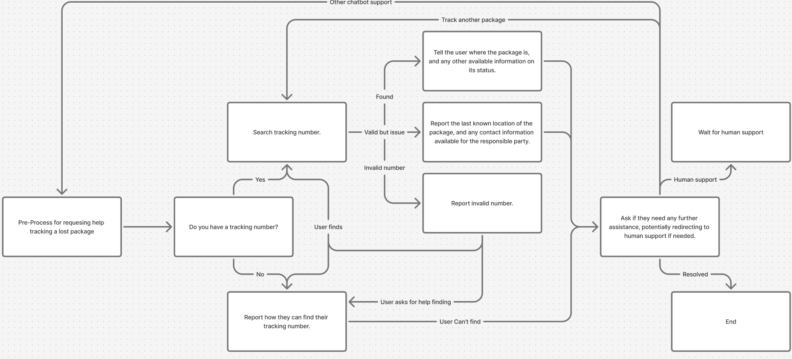
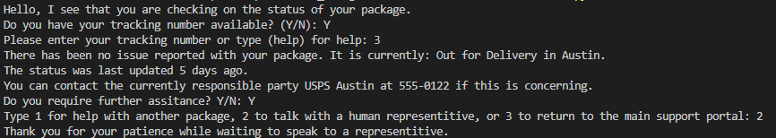
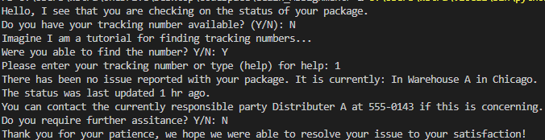
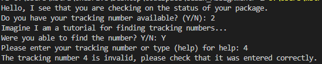
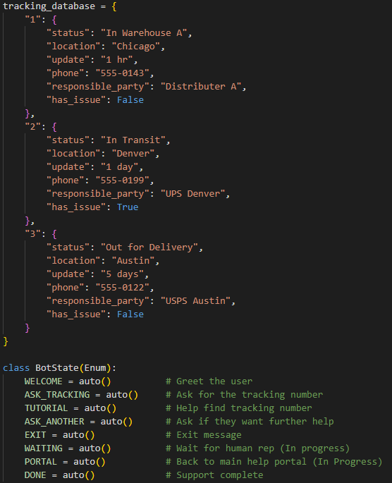

# eGain_Assignment
Simple customer package tracking support chatbot.

### Prerequisites
Make sure you have Python installed on your computer.

### Installation
Clone the repository and install the prerequisites.

### Usage examples
An example of the user quickly navigating the options, but finding the report from the database suspicious and asking for human support:  
  

Another example where the user needs help finding their tracking number:  
  

The user makes some invalid inputs:  
  

In some cases, an invalid input will be treated as a default response, generally for Yes/No questions. With the flow loop, it is quick to return in case an error.

Data formatting/status structure:  
  

This is a prototype and is missing a few features it would ideally have at the moment. These include an undo feature, and handling of certain statuses in different ways depending on how the new status is reached. For example, when asking for support after the tutorial there is an extra unnecessary prompt.
